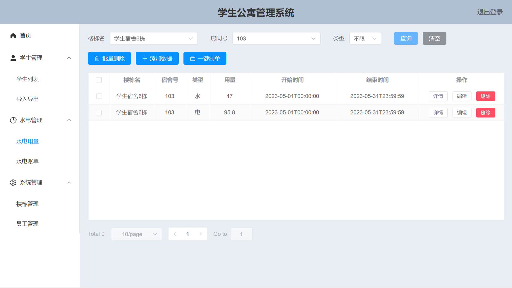

# 学生公寓管理系统（Web端）
[](https://wakatime.com/badge/user/dd052a23-1a65-4e6f-b05e-80bc93d8c93c/project/845f5f69-78bd-45f3-94cc-9eb296625f08) [](https://wakatime.com/badge/user/dd052a23-1a65-4e6f-b05e-80bc93d8c93c/project/f86a4af8-e70c-4c7b-94dd-73425e3dd6d2)

<div align=center style="max-width: 100%; height: auto; width: 100%; max-width: 400rpx;">
  
  
  
  
  
  
</div>

## 配套项目

Java后端：https://github.com/betacat-ha/student-apartment-management-system

iOS端：https://github.com/betacat-ha/student-apartment-management-system-ios

## 项目部署 Project setup
```
pnpm install
```

### 开发环境构建 Compiles and hot-reloads for development
```
pnpm run serve
```

### 生产环境构建 Compiles and minifies for production
```
pnpm run build
```
